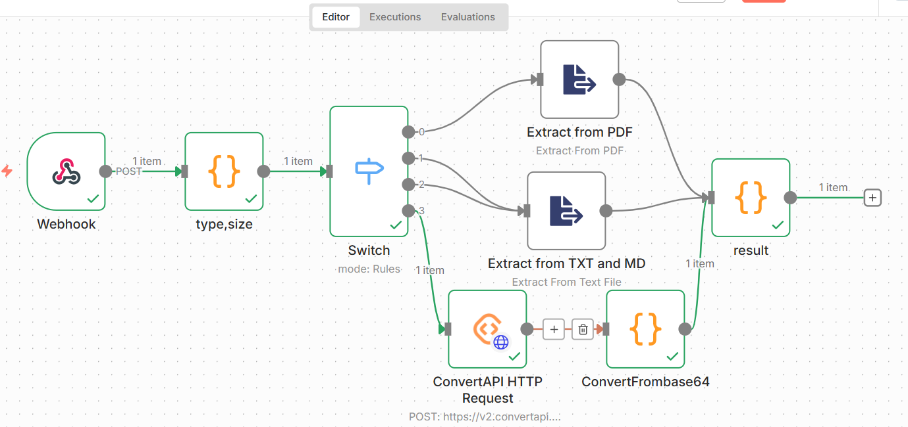

# Инструменты

Для извлечения текста из файла был выбран n8n, т.к. позволяет быстро и удобно развернуть приложение, которое позволит извлекать текст из файлов любого вида. Кроме этого n8n еще был использован для определения типа файла и размера.

Для суммаризации и нахождения ключевых слов был использован ChatGPT через API, так как у них продвинутые LLM с приемлемой ценой API (4o с такой задачей справляется).

Для написания самого бота был выбран aiogram, т.к. это самый продвинутый фреймворк для асинхронных ботов на Питоне.

Для определения языка текста была использована библиотека langdetect, т.к. удобна в использовании и не требует похода во внешние API.

Сам результат для каждого файла записывается в Google Sheets при использовании gspread-asyncio.

Сохраняются name, size, type, language, timestamp, uploader, summary и keywords.
https://docs.google.com/spreadsheets/d/1FWCSV6riSNbNKpDuRT67mBvdhsXk_R5VtGbnThf6P58/edit?usp=sharing

TELEGRAM_BOT_TOKEN, OPENAI_API_KEY, SPREADSHEET_ID и N8N_WEBHOOK_URL хранятся в виде переменных окружения. Json с credentials для Google Cloud API необходимо положить в app/services.

# Сложности

Главная сложность была с docx файлами, т.к. стандартные вершины в n8n не позволяют доставать текст из них (использовался n8n cloud), но это решилось подключением convertapi.com в n8n.

# Улучшения

Было бы актуально добавить OCR, т.к. иногда имеются только сканы документов.

Можно добавить статистику по документам и возможность для пользователя посмотреть его суммаризации.

Также можно добавить возможность просмотра в списке связанных документов (например, близких по ключевым словам).